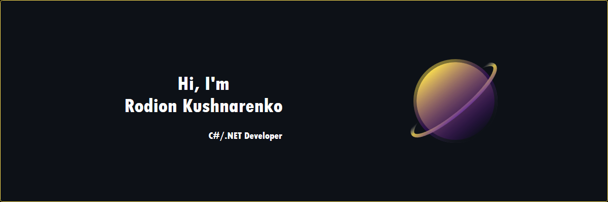

I'm a student-programmer from Moscow, working in a .NET development field. My area of interest is also low-level programming & IoT.
* 🔨 I’m currently working on my project [Microclimate Measurement System](https://github.com/Neutroo/Microclimate-Measurement-System)
* 📚 I’m currently learning SQL and Entity Framework Core

## 🧰 Languages and Tools

## 📈 GitHub Stats

  
  

